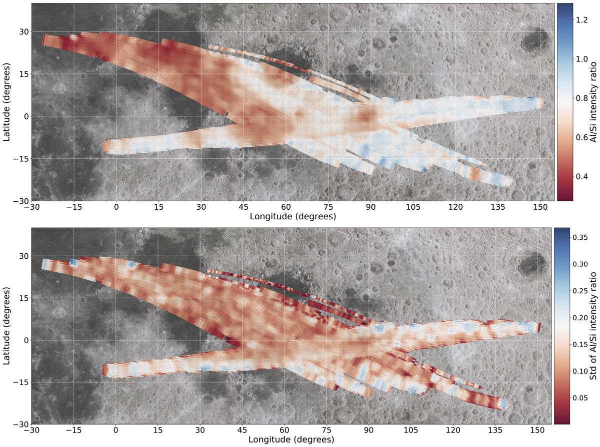
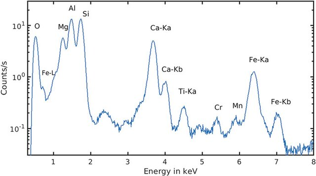

# High-Resolution Elemental Mapping of Lunar Surface

## :lock: Problem Description

X-ray fluorescence (XRF) lines are detected in CLASS during solar flares. The XRF line energy identifies the element, while the intensity depends on solar flare strength, solar zenith angle, and composition. By taking linear ratios, the angular dependence and incident solar flux dependence can be eliminated to some extent.

For example, Mg/Si and Al/Si ratios can reflect the compositional heterogeneity fairly well (Figure 1). 
Global XRF line ratio maps at a spatial resolution of ~12 km can be generated from CLASS data, which would create a new independent map useful for geochemical and resource mapping.

*Figure 1*

The observed spectrum in CLASS (Figure 2) consists of XRF lines, scattered solar X-rays, and background arising from particles in the lunar orbit. The routine CLASS data analysis pipeline models the X-ray spectra with good statistics to derive elemental abundances.  
Several spectra are added to achieve statistics, except for occasions when the incident solar flux is high.

 
*Figure 2*

The objective here is to utilize the entire set of XRF spectra measured by CLASS to derive XRF line intensities and create a high-resolution elemental ratio map that would identify compositional differences at kilometer scales.

## :books: Resources

Data:
https://pradan.issdc.gov.in/ch2/

Manual:
https://pradan.issdc.gov.in/ch2/protected/downloadFile/class/ch2_class_pds_release_38_20240927.zip

CLASS Instrument:
https://www.currentscience.ac.in/Volumes/118/02/0219.pdf
https://www.sciencedirect.com/science/article/abs/pii/S0019103521001196

CLASS Elemental Maps:
https://www.sciencedirect.com/science/article/abs/pii/S0019103523004773

Planetary X-ray Fluorescence Spectroscopy:
https://www.sciencedirect.com/science/article/abs/pii/S0032063312002942
